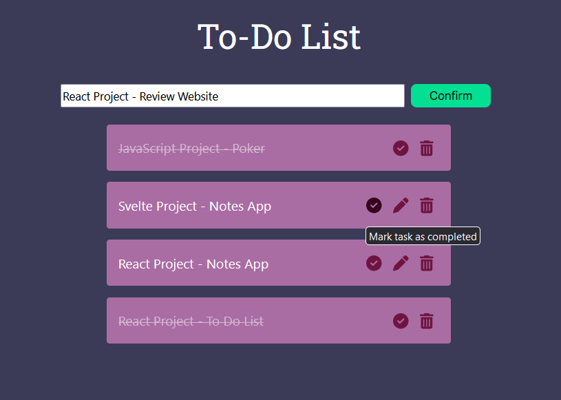
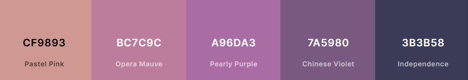
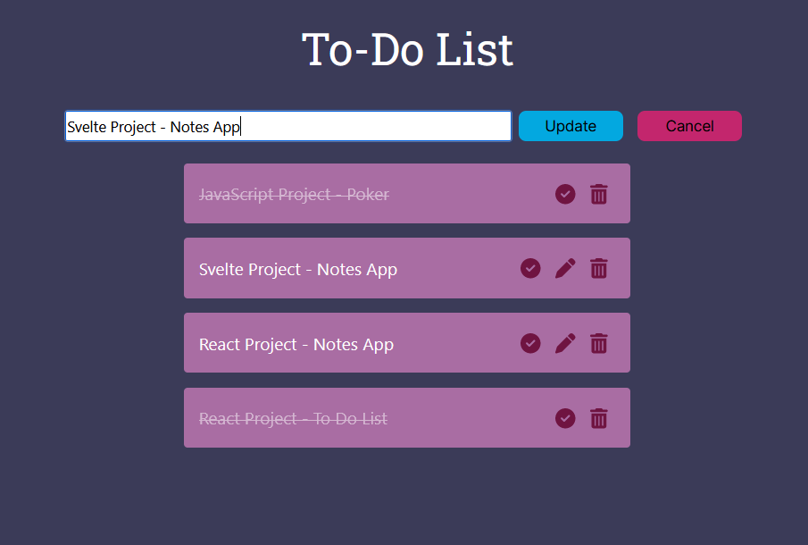

# React: To-Do List

A simple to do list application written in React.

### App in Add Mode

### Stack:

HTML, SCSS, JavaScript, ReactJS

## MVP:

-   Ability to write something to do and submit it
-   Added to a list below
-   Can edit or delete items or mark them as completed
-   Filtering to see completed items (ext)

## Colour Palette and Graphic Design

As usual, I used a base colour palette from coolors.co and expanded on it.

I really liked the way all of the colours in this palette fit together but it lacked any really bright, bouncy colours, so I will be adding some to really give the website a bit more of a pop. This can be seen in the clickable icon colours - these really draw attention to the buttons.

## Updates:

-   Changed ID to uuid generator so there are no duplicate IDs even if certain items are deleted
-   Fixed updating
-   Removed ID appearing on screen

## Extensions

-   Highlight item being edited
-   Implement search functionality
-   Implement filter functionality - completed vs incomplete

### App in Edit Mode:

